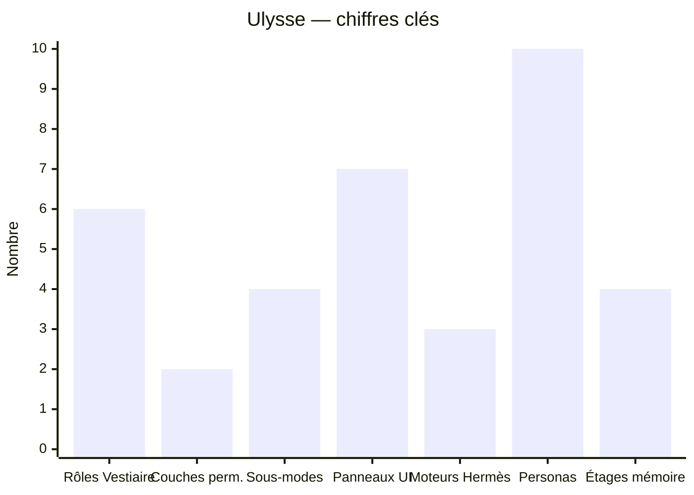

# Ulysse — En bref

> Synthèse générée le 2026-08-11 à partir des fichiers du dossier `Projet Ulysse`
> (BRIEF.md, plan.md, RESUME-ULYSSE.md, .hermes.md, architecture-projet.md).
> Tout ce qui suit est tiré de ces documents, pas inventé.

## 1. Qu'est-ce qu'Ulysse ?

**Ulysse est un MASQUE VISUEL** : une interface web locale (HTML Material 3)
posée **par-dessus Hermes Agent**. On ne réinvente rien — on câble une coquille
UI sur les composants **déjà existants** de Hermès.

- L'utilisateur final (grand public, non technique) ne voit qu'une icône bureau.
- Double-clic → l'interface web s'ouvre dans le navigateur → Hermès travaille
  **en arrière-plan, invisible**. Zéro friction.
- Livrable = app web locale packagée pour *sembler* une app de bureau
  (raccourci bureau qui lance les moteurs Hermès puis ouvre `localhost`).

**Loi d'or :** tout est modifiable, on ne code rien from scratch — uniquement du
**câblage** (entrée UI → endpoint Hermès → sortie).

---

## 2. Tableau — Les 7 panneaux UI et leur câblage Hermès

Chaque composant UI = une **entrée** → un **endpoint Hermès** réutilisé.

Légende endpoints : **[A]** proxy `:8645` (chat) · **[B]** gateway `:8644`
(webhook) · **[C]** serve `:9119` (RPC/WS) + `$HERMES_HOME` (fichiers profil).

| Panneau | Nom            | Rôle                                                | Endpoint Hermès                 | Type           |
|---------|----------------|-----------------------------------------------------|---------------------------------|----------------|
| M1      | Discuter       | Chat pur (Discussion)                               | [A] proxy /chat/completions     | Chat           |
| M2      | Studio         | Miroir temps réel du plan de l'agent                | [C] flux gateway (miroir)       | Affichage live |
| M3      | Vestiaire      | 6 rôles + agents spécialisés                        | [C] gateway RPC / $HERMES_HOME  | Profil         |
| M4      | Projets        | Coffre par projet, bac à sable isolé                | [C] dossier projet Hermès       | Profil/FS      |
| M5      | Réglages       | user.md / soul.md / MEMORY / config                 | [C] fichiers profil             | Profil/FS      |
| M6      | Cloche         | Notifications                                       | aucun (host.onEvent)            | Local          |
| M7      | Densité        | Épuré / dense                                        | aucun (affichage local)        | Local          |

---

## 3. Graphique — Architecture (le masque au-dessus de Hermès)

```mermaid
flowchart TB
    U([Utilisateur final<br/>double-clic bureau]) -->|ouvre navigateur| UI[Interface web Ulysse<br/>HTML Material 3 local]

    subgraph MOTEUR [Moteurs Hermès — démarrés par l'installateur]
        P["hermes proxy :8645<br/>chat (Discussion)"]
        G["hermes gateway :8644<br/>webhooks + canaux"]
        S["hermes serve :9119<br/>Cowork / Studio / FS / mémoire / MCP"]
    end

    UI -->|[A] Discuter| P
    UI -->|[B] boutons précis| G
    UI -->|[C] Cowork / Studio / FS| S
    UI -.->|M6 cloche, M7 densité| UI

    subgraph PROFIL [Profil $HERMES_HOME]
        F["config.yaml · .env · user.md · soul.md<br/>MEMORY.md · roles/ · agents/ · projects/"]
    end
    S -->|lit/écrit| F

    subgraph VEST [Vestiaire — 6 rôles]
        R1[Orchestrateur] & R2[Généraliste] & R3[Raisonnement] & R4[Codage] & R5[Appel d'outil] & R6[Garde-fou + 3 fantômes]
    end
    F --> VEST

    subgraph PERM [Permissions 2 couches]
        C1[Surface: Discussion vs Cowork]
        C2[4 sous-modes: Auto / Accept-edit / Manuel / Plan]
    end
    UI -->|PERM| C1 --> C2

    G -.->|canal distant| TG([Telegram — pilotage sans UI])
```

---

## 4. Graphique — Les chiffres clés (barres)



---

## 5. Les chiffres clés (table)

| Élément                        | Valeur |
|--------------------------------|--------|
| Rôles du Vestiaire             | 6 (+ 3 fantômes dans Garde-fou) |
| Couches de permission          | 2 (Discussion / Cowork) |
| Sous-modes (Cowork)            | 4 (Auto / Accept-edit / Manuel / Plan) |
| Personas de test               | 10 (P1–P10) |
| Moteurs Hermès démarrés        | 3 (proxy 8645 / gateway 8644 / serve 9119) |
| Panneaux UI (menu latéral)     | 7 (M1–M7) |
| Fichiers standard par projet   | 6 (.hermes, BRIEF, REPRISE, plan, done, ADM) |
| Étages de mémoire              | 4 (vif / index / journaux / durable) |

---

## 6. État du projet (au 2026-08-11)

- **Phase** : Développement — architecture validée, étapes zéro prouvées en réel.
- **Maquette** : `maquette-ulysse-google-33.html` (front-only, à relier aux endpoints).
- **Jalons** (plan.md) :
  - ✅ Architecture + carte endpoints validés
  - ✅ Étape zéro : proxy / webhook / serve prouvés en réel
  - ✅ Profil kuchu fusionné + connexion Obsidian
  - ✅ Dev A : Discussion pur (infra prouvée ; bout-en-bout en attente)
  - ⬜ Dev B : Cowork (WebSocket) + auth
  - ⬜ Dev C : Studio, webhooks, Vestiaire
  - ⬜ Installateur `.bat`

---

## 7. Sources

- `BRIEF.md` — description + phase
- `plan.md` — jalons et risques
- `RESUME-ULYSSE.md` — synthèse complète
- `.hermes.md` — règles projet (masque, endpoints, Vestiaire, permissions)
- `architecture-projet.md` — nature app web locale
